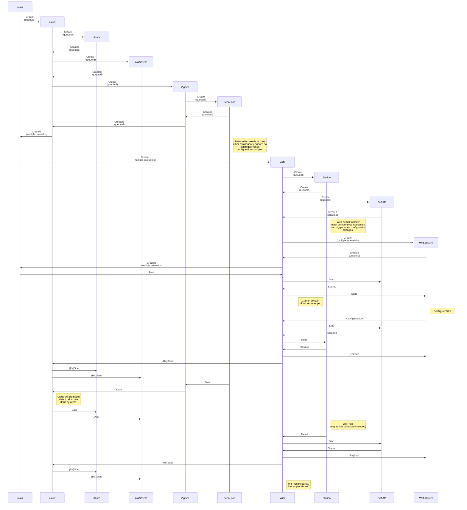

# Component Creation etc.

```mermaid

sequenceDiagram;

    participant m as main;

    create participant cl as cloud;
    m->>cl: Create<br/>(queueId);


    create participant az as Azure;
    cl->>az: Create<br/>(queueId);
    az->>cl: Created<br/>(queueId);

    create participant aw as AWS/GCP;
    cl->>aw: Create<br/>(queueId);
    aw->>cl: Created<br/>(queueId);

    create participant zb as ZigBee;
    cl->>zb: Create<br/>(queueId);

    create participant sr as Serial port;
    zb->>sr: Create<br/>(queueId);
    sr->>zb: Created<br/>(queueId);

    zb->>cl: Created<br/>(queueId);
    cl->>m: Created<br/>(multiple queueIds);

    Note right of sr: Station/Web needs to know<br/>other components' queues so <br/>can trigger when<br/>configuration changes.;

    create participant wf as WiFi;
    m->>wf: Create<br/>(multiple queueIds);

    create participant st as Station;
    wf->>st: Create<br/>(queueId);
    st->>wf: Created<br/>(queueId);

    create participant sa as SoftAP;
    wf->>sa: Create<br/>(queueId);
    sa->>wf: Created<br/>(queueId);

    Note right of st: Web needs to know<br/>other components' queues so<br/>can trigger when configuration<br/>changes.;

    create participant wb as Web Server;
    wf->>wb: Create<br/>(multiple queueIds);
    wb->>wf: Created<br/>(queueId);

    wf->>m: Created<br/>(multiple queueIds);

    m->>wf: Start;
    wf->>+sa: Start;
    sa->>wf: Started;
    wf->>wb: Start;

    Note left of st: Cannot contact<br/>cloud services yet.;

    Note right of wb: Configure WiFi;

    wb->>wf: Config change;

    wf->>+sa: Stop;
    sa->>wf: Stopped;
    wf->>+st: Start;
    st->>wf: Started;

    wf->>wb: (Re)Start;
    wf->>cl: (Re)Start;
    cl->>az: (Re)Start;
    cl->>aw: (Re)Start;

    sr->>zb: Data;
    zb->>cl: Data;

    Note right of cl: Cloud will distribute<br/>data to all active<br/>cloud systems.;

    cl->>az: Data;
    cl->>aw: Data;

    Note right of st: WiFi fails<br/>(e.g. router password changed);

    st->>wf: Failed;
    wf->>sa: Start;
    sa->>wf: Started;
    wf->>wb: (Re)Start;
    wf->>cl: (Re)Start;
    cl->>az: (Re)Start;
    cl->>aw: (Re)Start;

    Note right of wf: WiFi reconfigured,<br/>flow as per above.";
```