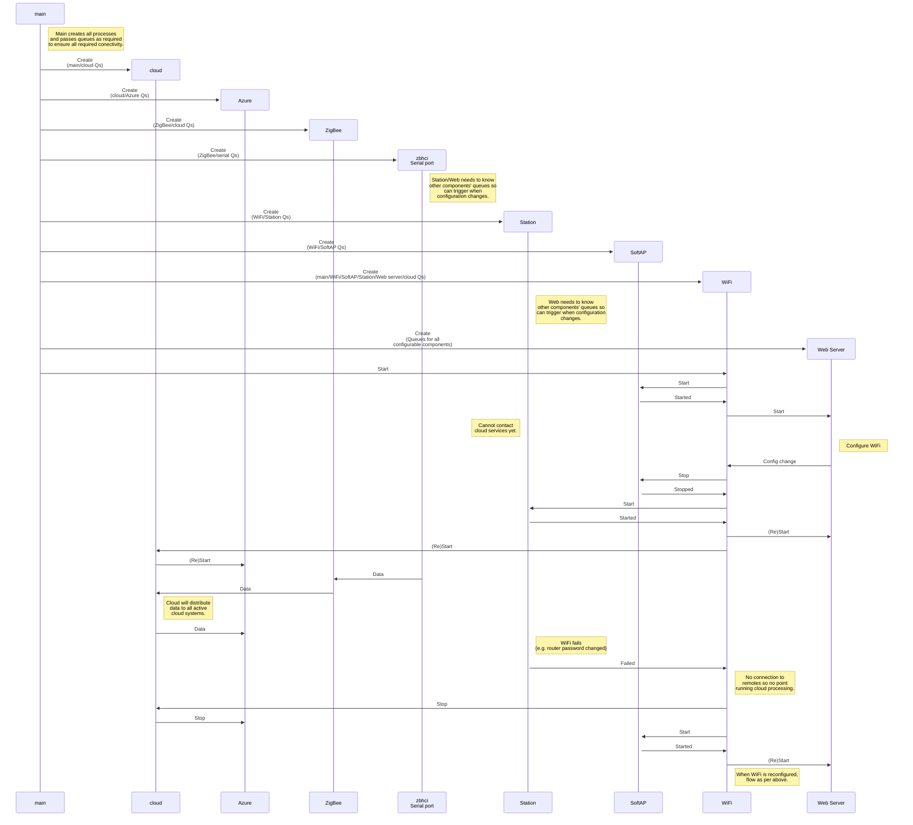

# Component Creation etc.

```mermaid

sequenceDiagram;

    participant m as main;

    Note right of m: Main creates all processes<br/>and passes queues as required<br/>to ensure all required conectivity.

    create participant cl as cloud;
    m->>cl: Create<br/>(main/cloud Qs);

    create participant az as Azure;
    m->>az: Create<br/>(cloud/Azure Qs);

    create participant zb as ZigBee;
    m->>zb: Create<br/>(ZigBee/cloud Qs);

    create participant zh as zbhci<br/>Serial port;
    m->>zh: Create<br/>(ZigBee/serial Qs);

    Note right of zh: Station/Web needs to know<br/>other components' queues so <br/>can trigger when<br/>configuration changes.;

    create participant st as Station;
    m->>st: Create<br/>(WiFi/Station Qs);

    create participant sa as SoftAP;
    m->>sa: Create<br/>(WiFi/SoftAP Qs);

    create participant wf as WiFi;
    m->>wf: Create<br/>(main/WiFi/SoftAP/Station/Web server/cloud Qs);

    Note right of st: Web needs to know<br/>other components' queues so<br/>can trigger when configuration<br/>changes.;

    create participant wb as Web Server;
    m->>wb: Create<br/>(Queues for all<br/>configurable components);

    m->>wf: Start;
    wf->>+sa: Start;
    sa->>wf: Started;
    wf->>wb: Start;

    Note left of st: Cannot contact<br/>cloud services yet.;

    Note right of wb: Configure WiFi;

    wb->>wf: Config change;

    wf->>+sa: Stop;
    sa->>wf: Stopped;
    wf->>+st: Start;
    st->>wf: Started;

    wf->>wb: (Re)Start;
    wf->>cl: (Re)Start;
    cl->>az: (Re)Start;

    zh->>zb: Data;
    zb->>cl: Data;

    Note right of cl: Cloud will distribute<br/>data to all active<br/>cloud systems.;

    cl->>az: Data;

    Note right of st: WiFi fails<br/>(e.g. router password changed);

    st->>wf: Failed;

    Note right of wf: No connection to<br/>remotes so no point<br/>running cloud processing.
    wf->>cl: Stop
    cl->>az: Stop
    wf->>sa: Start;
    sa->>wf: Started;
    wf->>wb: (Re)Start;

    Note right of wf: When WiFi is reconfigured,<br/>flow as per above.
```
