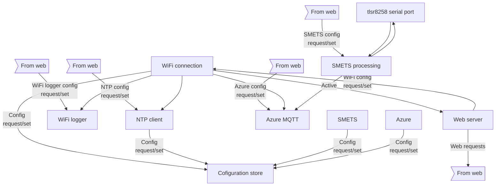

# ESP32 Components

## Component Creation Order
1. Configuration store
1. tlsr8258 serial port
1. SMETS processing; 2-way with tlsr8258
1. WiFi logger
1. Azure MQTT
1. Web server; 2 way with WiFi connection
1. NTP client
1. WiFi connection; 2 way with web

# FreeTOS/Tasks
The ESP32 is actually a multi-threaded envuironment based on FreeTOS so the components can be structured as tasks with inter-task communication via message queues.  This means that there is no need for the dependency injection stuff and any task A can send or receive from any task B.

The following describes how each task operates.  The tasks described are:

- Configuration store
- tlsr8258 serial port
- SMETS processing
- WiFi logger
- Azure MQTT
- Web server
- NTP client
- WiFi connection
- Heartbeat/Watchdog

## Configuration Store
### Purpose
- Reads and writes configuration from/to the non-volatile RAM of the ESP32
- Provides default configuration if none already exists for any queried configuration value

### Messages
#### Received
- Configuration read
  - Key name of the field required
- Clear (reset) all configuration
#### Sent
- Configuration value
  - Key name of the configuration that is being provided
  - Value of the configuration being provided
- Configuration updated?
  - Maybe used to indicate that confguration has changed.
  - Might be via the web page?

## SMETS Processing
### Purpose
Exchanges messages with the tlsr8258 over the serial connection to do the following:
- Configure the Zigbee connection and request a (re)connection
- Receive SMETS data as notifications from the SMETS network
- Provides the SMETS data to the "send to cloud" components.

> Question: Do we want a single "cloud manager" that farms requests to the various cloud providers (and the local debugging instance?)

### Messages
#### Received
- Web: Zigbee configuration, requesting a (re)connect
- Web: Request Zigbee information/status
  - Are we connected?
  - What was the remote key (if available)?
  - When was the last message received?

#### Sent
- Web: Zigbee information/status
- Azure: SMETS data received as Zigbee notifications and converted into sensible JSON.
  - This could get ugly; can we pass big messages?

## WiFi logger
### Purpose
The ESP-IDF SDKs have support for logging over a serial port but we also want
to be able to log over WiFi.  This should happen in two ways:
- To a local server (make this an MQTT device?)
- To the clound

This task performs that logic if required.

## Azure MQTT (and others later)
### Purpose
Maintains a copnnection to and Azure system and sends MQTT messages for:
- SMETS data
- Logging data.

This task is required to handle authentication and reauthentication when this expires (as it does every hour or so!).

### Messages
#### Receives
- WiFi: Access Point (AP) WiFi is active
- WiFi: Access Point (AP) WiFi is lost
  - It does not make sense to try and send MQTT messages when in ad-hoc WiFi mode or when the WiFi is down.
- SMETS: SMETS messages (as JSON)
- ???: Logging messages (as JSON)

#### Sends
- None

## Web Server
### Purpose
- Provides a simple web interface for configuration

### Messages
#### Sends
- Config: Request configuration
  - Each page starts by showing the current configuration
- Config: Configuration changed
- Reboot
- Reset all configuration.

#### Receives
- WiFi: WiFi is active
- WiFi: WiFi is lost
  - The web server can be active when either AP or ad-hoc mode is active.
- config: Configuration requested

## NTP Client
### Purpose
- Request NTP time

### Messages
#### Sends
- None; the NTP system sets the time and other tasks just pick this up.

#### Receives
- WiFi: AccessPoint WiFi is active/lost
  - NTP time is only available when connected to the internet.

## WiFi Connection
### Purpose
- Manage the WifI connection
- Wherever possible, create an AP WiFi connection
- When AP WiFi is not available, create an ad-hoc connection

### Messages
#### Sends
- Request WiFi configuration
- WiFi status (AP up, Ad-hoc up, WiFi down) notifications

#### Receives
- WiFi configuration values

## Heartbeat/Watchdog
### Purpose
Monitors the health of the system as defined by regular SMETS information being sent to the configured cloud monitors.

If the health is considered to have failed, the system is rebooted.

> Note that the tlsr8258 has to be rebooted first (by cycling power) and then the ESP32 is rebooted.

#### Sends
- Request configuration

### Receives
- Configuration
- Heartbeat each time a SMETS message is relayed to the cloud systems

## Hard-reset
### Purpose
Monitors the reset button and clears all configuration if pressed for a period of 5seconds.

### Messages
#### Sends
- Reset all configuration
#### Receives
- Reset all configuration if reset via the Web server.

> Question:/ Should

