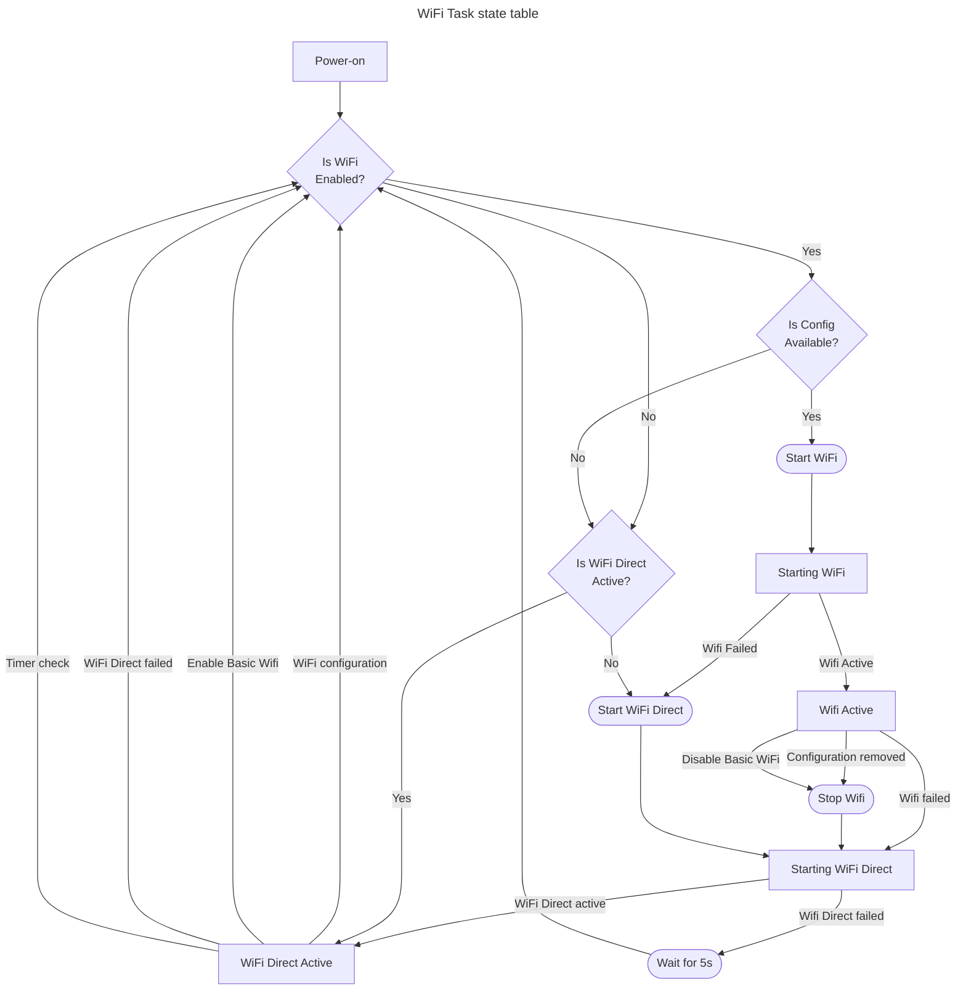

# WiFi Task Design
## States
- Power on
- Starting WiFi Direct
- WiFi Direct active
- Starting WiFi network
- WiFi Network active

## Inputs
- Valid WiFi configuration
- No valid configuration
- WiFi configuration removed
- Wifi network failed
- Reset to Wifi direct (from webpage or key press)
- Disable Basic WiFi
- Enable Basic WiFi

## State Table
