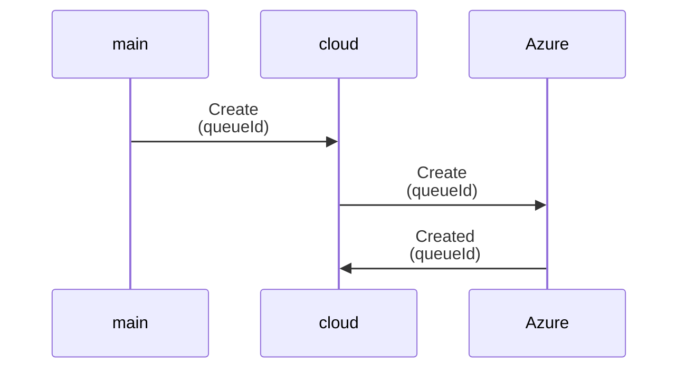

# Component Creation etc.

```mermaid

sequenceDiagram;

    participant m as main;

    participant cl as cloud;
    m->>cl: Create<br/>(queueId);

    participant az as Azure;
    cl->>az: Create<br/>(queueId);
    az->>cl: Created<br/>(queueId);
```
