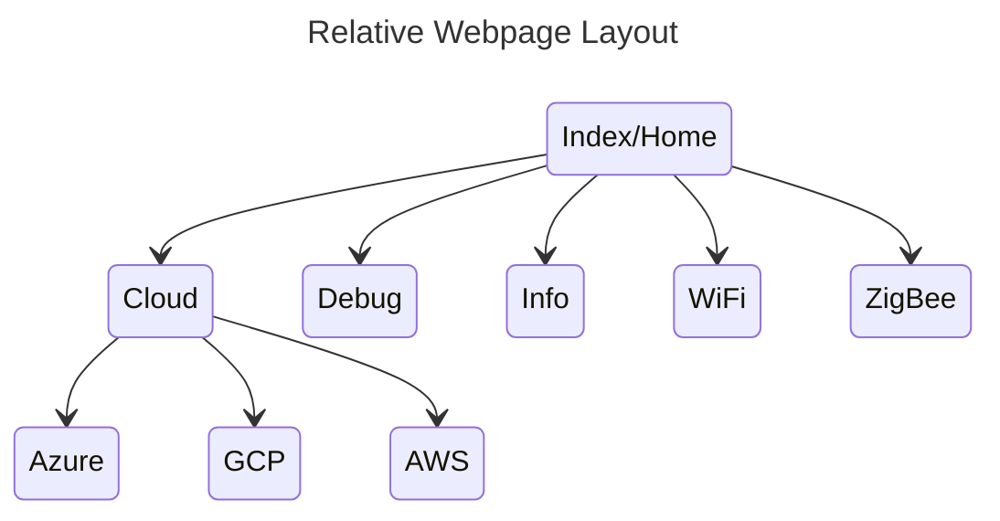
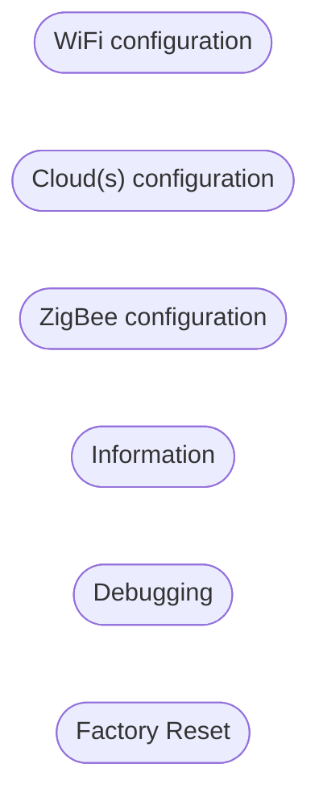

# WebPages Design
## Page Layout

- All pages have a link back to the parent
- All pages have a link back to `Home`
- All configuration pages have a `Save` and `Cancel` button
    - `Save` will save changes then reenter the page, now displaying the new information
    - `Cancel` will reenter the page, displaying again the current (unchanged) configuration
- Information only pages only have the `Home` and `Parent` links

## CSS (Cascading Style Sheets)
- Pretty basic styling
- Must work for mobiles
- Should also work for PCs
    - Can we detect or should we have two sets of selectable styles?

~~~
Where should the OTA configuration be?
~~~

## Page Design
### / (Index)
||||
|-|-|-|
||WiFi configuration||
||Cloud(s) configuration||
||ZigBee configuration||
||Information||
||Debugging||
||Factory Reset||
||||
### /cloud
||||
|-|-|-|
||Azure||
||Google Cloud Platform||
||Amazon web Services||
||Local Debugging||
|-| |-|
||Home||
||||
### /cloud/azure

### /cloud/gcp

### /cloud/aws

### /debug

### /info

### /reset

### /wifi
||||
|-|-|-|
||SSID:||
||Password:||
|-||-|
|Save||Cancel|
|-||-|
|Home||Back|
||||

### /zigbee

