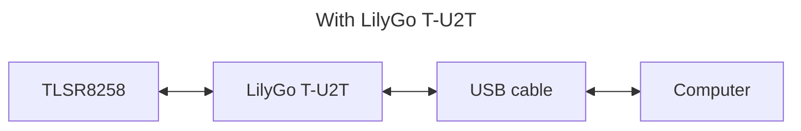
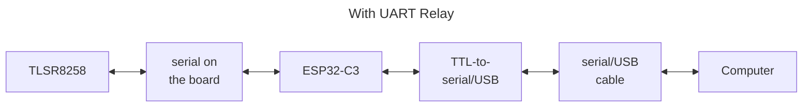

# UART Relay - testing tool

## IMPORTANT STUFF
1. You will still need at least one [LilyGo] [T-U2T] in order to load applications onto your [LilyGo] [T-ZigBee] boards.
2. You will need a 3.3V TTL-to-Serial/USB (aka FTDI) board to complete the connection from the [ESP32-C3] to your computer.
3. You cannot use a simple _two ports, relay back-and-force_ test to prove this UART relay works on the [T-ZigBee] because of _interesting_ wiring of the [T-ZigBee] board.  Basically it does some off switching of the UART ports when you are uploading [ESP32-C3] or [TLSR8258] firmware and the UART relay will only work properly when the [ESP32-C3] is connected through to the [TLSR8258] chip with the [T-U2T] disconnected.

The UART Relay is a simple [ESP32-C3] UART relay that can used when testing [Telink] [TLSR8258] applications on the [LilyGo] [T-ZigBee] board.  The UART relay allows a UART (serial) connection be be created to the [Telink] [TLSR8258] board via the [ESP32-C3] for testing purposes.  The two connectivities are:




## T-ZigBee Configuration
After loading the [ESP32-C3] and [TLSR8258] images, the [T-ZigBee] DIP switches should all be set to _off_ i.e. _down_ towards the side of the board that has the USB port on it.

> It would appear that the [T-ZigBee] DIP switches are wrongly marked.  Although the switches are all _off_, the UARTs are connected through the IDP switches!
>
> Also not that on the [T-Zigbee] schematics, RDX and TXD are shown (bottom left) but note that R13 and R15 are marked _NC_ i.e. there is **No** connection!

## Function
The UART relay does the following:
- Enables the [ESP32-C3]'s GPIO0 (XTAL_OUT) as an output and sets it high; this is the line that the [T-ZigBee] board uses to enable power to the [TLSR8258.]
- Enables the [ESP32-C3]'s GPIO3 as an output and sets it high; this turns on the blue LED on the far end of the [T-ZigBee] board.  The other blue LED in the centre of the board simply indicates that there is power available to the [T-ZigBee] board's power circuits.
- Opens two UARTs, UART1 (GPIO18 and GPIO19) which the T-ZigBee has internally connected to the DIP switches and UART0 which is exposed as the GPIO20 and GPIO21 pins on the board.
- Sits forever, checking the two UART RX lines, receiving anything found and relaying it to the other UARTs TX line.

## Building
### Preparation
Install the [Espressif] [ESP-IDF] build environment.

### Configuration
The configuration should be set by running the usual [ESP32-C3] menu based configurator.

```bash
$ get_idf
$ cd git/cloudsmets/esp32/uartrelay
$ idf.py set-target esp32c3
$ idf.py menuconfig
```
The UART Relay configuration menu item leads to the settings whichi should take these values:

|Value|Setting|
|-|-|
|0|UART port A number|
|1|UART port B number|
|1000000|UART communication rate (baud)|
|20|UART RXD A pin number (GPIO)|
|21|UART TXD A pin number (GPIO)|
|19|UART RXD B pin number (GPIO)|
|18|UART TXD B pin number (GPIO)|
|4096|UART echo example task stack size|

> Note that the port B TX and RX ports are **deliberately switched**.  This is because of the wiring on the [T-ZigBee] board, which can been understood from the [T-ZigBee Schematic].  Note however that the [T-ZigBee Schematic] numbers to DIP switches in reverse - RST/RESETB is actually switch 5!

### Compilation & Linking
```bash
$ idf.py build
```

### Upload
> Note that the latest `esptool.py` is a Python package that has to be installed.  Older instances of `esptool.py` cannot install to the [ESP32-C3].

To upload, follow the instructions presented at the end of the [ESP32-C3] build process.

[Espressif]: https://www.espressif.com/
[ESP32-C3]: https://www.espressif.com/en/products/socs/esp32-c3
[LilyGo]: https://www.lilygo.cc
[T-ZigBee]: https://www.lilygo.cc/products/t-zigbee-esp32-c3-tlsr8258
[T-U2T]: https://www.lilygo.cc/products/t-u2t
[Telink]: https://www.telink-semi.cn/
[TLSR8258]: https://wiki.telink-semi.cn/wiki/chip-series/TLSR825x-Series/
[T-ZigBee Schematic]: https://github.com/Xinyuan-LilyGO/T-ZigBee/blob/main/Schematic/T-Zigbee.pdf