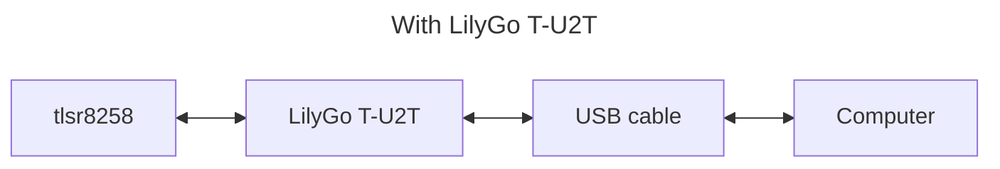
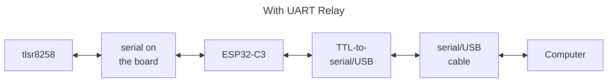

# UART Relay - testing tool

## IMPORTANT STUFF
1. You will still need at least on [LilyGo T-U2T] in order to load applications onto your [LilyGo T-ZigBee] boards.
2. You will need a 3.3V TTL-to-Serial/USB (aka FTDI) board to complete the connection from the [ESP32-C3] to your computer.
3. You cannot use a simple _two terminals, relay back-and-force_ test to prove this UART relay works on the T-ZigBee because of _interesting_ wiring of the T-ZigBee board.  Basically it does some off switching of the UART ports when you are uploading ESP32-C3 firmware and the UART relay will only work properly when the ESP32-C3 iss connected through to the tlsr8258 chip

The UART Relay is a simple [ESP32-C3] UART relay that can used when testing Telink tlsr8258 applications on the LilyGo T-ZigBee board.  The UART relay allows a UART (serial) connection be be created to the [Telink tlsr8258] board via the [ESP32-C3] for testing purposes.  The two connectivities are:




## Function
The UART relay does the following:
- Enables the [ESP32-C3]'s GPIO0 (XTAL_OUT) as an output and sets it high; this is the line that the T-ZigBee board uses to enable power to the tlsr8258.
- Enables the [ESP32-C3]'s GPIO0 (XTAL_OUT) as an output and sets it high; this turns on the blue LED on the far end of the T-ZigBee board.  The other blue LED in the centre of the board simply indicates that there is power available to the T-ZigBee board's power circuits.
- Opens two UARTs, UART1 (GPIO18 and GPIO19) which the T-ZigBee has internally connected to the DIP switches and UART0 which is exposed as the GPIO20 and GPIO21 pins on the board.
- Sits forever, checking the two UART RX lines, receiving anything found and relaying it to the other UARTs TX line.

## Building
### Preparation
Install the [Espressif] [ESP-IDF] build environment.

### Configuration
The default configuration for the UART relay should be sufficient but you do need to run the cnofiguration step to save the configuration.

```bash
$ cd git/cloudsmets/esp32/uartrelay
$ idf.py set-target esp32c3
$ idf.py menuconfig
```

### Compilation & Linking
```bash
$ idf.py build
```

### Upload
> Note that the latest `esptool.py` is a Python package that has to be installed.  Older instances of `esptool.py` cannot install to the pESP32-C3].
$ ...follow instructions...

[Espressif]: https://www.espressif.com/
[ESP32-C3]: https://www.espressif.com/en/products/socs/esp32-c3
[LilyGo]: https://www.lilygo.cc
[T-U2T]: https://www.lilygo.cc/products/t-u2t
